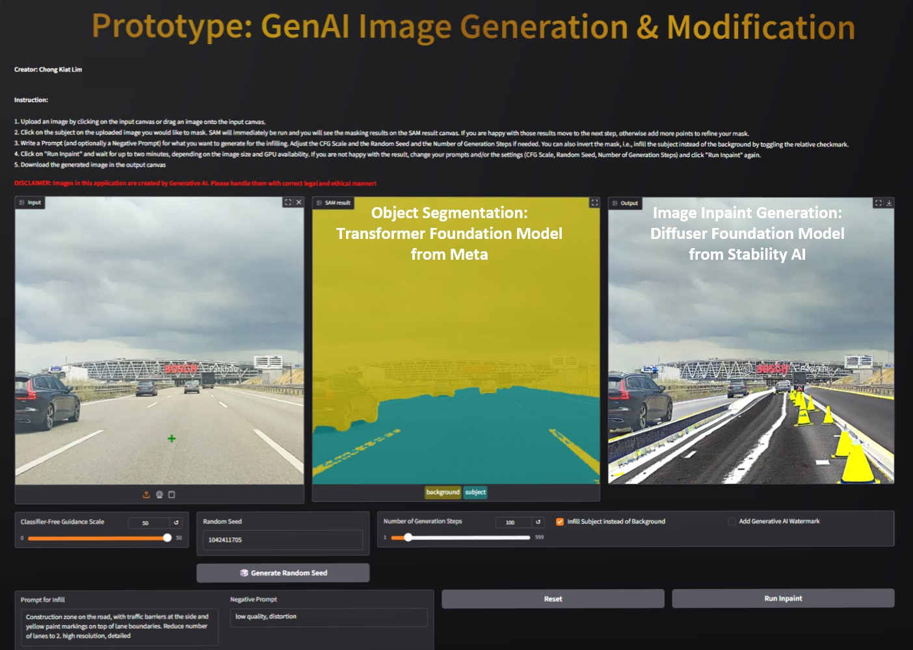

# Implementation

**Author: Chong Kiat Lim**

## Overview

This application combines two foundation models to enable AI-powered image inpainting through a web interface:

1. **Segment Anything Model (SAM)** — A Transformer-based object segmentation model from Meta
2. **Stable Diffusion Inpainting** — A Diffuser-based image generation model from Stability AI / RunwayML



## Architecture

```
User Input (Image + Click Points)
        │
        ▼
┌─────────────────────────┐
│   SAM (Meta)            │  ← Object segmentation via point prompts
│   facebook/sam-vit-base │
└──────────┬──────────────┘
           │ Binary Mask
           ▼
┌──────────────────────────────────────────┐
│   Stable Diffusion Inpainting            │  ← Text-guided image generation
│   runwayml/stable-diffusion-inpainting   │
└──────────┬───────────────────────────────┘
           │ Generated Image
           ▼
     Output (with optional AI watermark)
```

## Components

### `GenAI_Image_InPainting_application.py`

The main entry point that:

- Loads environment variables from `.env` using `python-dotenv`
- Initializes the SAM model and processor on GPU/CPU
- Initializes the Stable Diffusion Inpainting pipeline
- Defines `get_processed_inputs()` — runs SAM inference to produce a segmentation mask
- Defines `inpaint()` — runs the diffusion pipeline with prompt, mask, and generation parameters
- Launches the Gradio web application

### `app.py`

Contains the `InpaintGenAI` class and `generate_app()` function that builds the Gradio UI:

- Handles user click events to collect segmentation points
- Manages SAM mask generation and visualization
- Runs the inpainting pipeline with user-specified parameters
- Applies an AI-generated content watermark to outputs
- Handles NSFW content detection (returns black image with warning text)

### `.env`

Stores configuration and credentials:

| Variable | Purpose |
|----------|---------|
| `HF_TOKEN` | Hugging Face access token for gated models |
| `SAM_MODEL_NAME` | SAM model checkpoint (default: `facebook/sam-vit-base`) |
| `INPAINTING_MODEL_NAME` | Inpainting model checkpoint (default: `runwayml/stable-diffusion-inpainting`) |

## Key Implementation Details

- **Device handling**: Automatically selects CUDA GPU if available, otherwise falls back to CPU
- **Resolution handling**: Image dimensions are rounded up to multiples of 8 (required by the diffusion model)
- **Mask inversion**: The mask can be inverted to infill the subject instead of the background
- **Watermark**: An "AI Generated Image" watermark is overlaid on outputs, with automatic contrast adaptation (black or white) based on image brightness
- **Environment variables**: All model names and tokens are loaded from `.env` with sensible defaults

## Testing

Unit tests are located in `tests/test_app.py` and use **pytest** with mocked model dependencies to enable fast, GPU-free testing.

### Test Coverage

| Test Class | What It Tests |
|------------|---------------|
| `TestMakeDivisibleBy8` | Resolution rounding utility (boundary cases, zero, large values) |
| `TestMaskToRgb` | Mask-to-RGBA conversion (all-zero, all-one, partial masks, dtype) |
| `TestInpaintGenAI` | Class init, reset, preprocess, SAM execution, inpainting pipeline, NSFW guard |
| `TestResolutionHandling` | Preservation of original image dimensions through the pipeline |

### Running Tests

```bash
pytest tests/ -v
```
